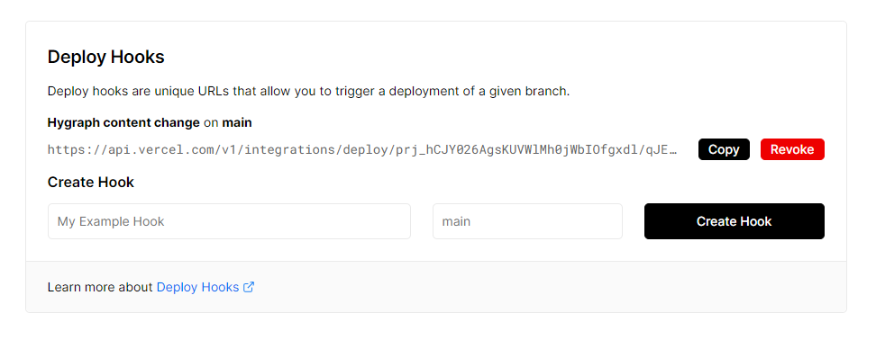
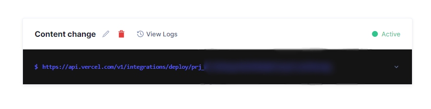

 <div align='center' >
 <a href="https://digital-shrine.vercel.app/">
    
  </a>
  </div>

## Tools 🛠️

#

<br>

- [![React][react.js]][react-url]
- [![TypeScript][typescript.ts]][typescript-url]
- [![Next.js][next.js]][next-url]
- [![Hygraph][hygraph.svg]][hygraph-url]
- [![GraphQL][graphql]][graphql-url]
- [![markdown][markdown]][markdown-url]
- [MDX](https://mdxjs.com/)

  <br/>

## Installation 🚀

#

1. Create free hygraph account at [hygraph.](https://hygraph.com/?utm_term=hygraph&utm_campaign=EN_GL_Brand&utm_source=adwords&utm_medium=ppc&hsa_acc=2816788452&hsa_cam=17734529757&hsa_grp=138464751243&hsa_ad=610082777931&hsa_src=g&hsa_tgt=kwd-1681477926128&hsa_kw=hygraph&hsa_mt=p&hsa_net=adwords&hsa_ver=3&gclid=CjwKCAiAwomeBhBWEiwAM43YILtwA8POgpY7YEda5XqewFaKpRzZ-TW9C82IkyXcVOXQN3kq2-fWSxoCL1gQAvD_BwE)
2. Clone the repository.
   ```sh
   git clone https://github.com/DeadBoyPiotrek/digital-shrine.git
   ```
3. Install NPM packages.
   ```sh
   npm install
   ```
4. Enter your API key in `.env.local`
   ```js
   NEXT_PUBLIC_HYGRAPH_API_KEY = 'your api key';
   ```
5. Run the app in the development mode.
   ```sh
   npm run dev
   ```

<br/>

## Add webhooks to automatically build your project on specific action e.g. adding new post. 👍

#





<br/>

## Testing testing one two three ✅

#

### Testing commands:

```
 "jest": "jest",
 "jestWatch": "jest --watch",
 "e2e": "npx playwright test",
 "test": "npm run e2e && npm run jest",
```

### Don't want to test on every push ? ⬇️

### Replace `pre-push` with `pre-push.copy` in:

```
.
└── .husky
    ├── pre-push
    └── pre-push.copy
```

[react.js]: https://img.shields.io/badge/React-20232A?style=for-the-badge&logo=react&logoColor=61DAFB
[react-url]: https://reactjs.org/
[typescript.ts]: https://img.shields.io/badge/TypeScript-20232A?style=for-the-badge&logo=typescript&logoColor=3791d2
[typescript-url]: https://www.typescriptlang.org
[next.js]: https://img.shields.io/badge/Next.js-20232A?style=for-the-badge&logo=next.js&logoColor=000000
[next-url]: https://nextjs.org/
[hygraph.svg]: https://img.shields.io/badge/Hygraph-20232A?style=for-the-badge&logo=Hygraph&logoColor=000000
[hygraph-url]: https://hygraph.com/?utm_term=hygraph&utm_campaign=EN_GL_Brand&utm_source=adwords&utm_medium=ppc&hsa_acc=2816788452&hsa_cam=17734529757&hsa_grp=138464719243&hsa_ad=610082777931&hsa_src=g&hsa_tgt=kwd-1681477926128&hsa_kw=hygraph&hsa_mt=p&hsa_net=adwords&hsa_ver=3&gclid=Cj0KCQiAn4SeBhCwARIsANeF9DI_PmhU4JrB32yu90zstilyJBQfv5aBIyr74rRdSsU1Gxi4owD0O8caAgkOEALw_wcB
[graphql]: https://img.shields.io/badge/-GraphQL-E10098?style=for-the-badge&logo=graphql&logoColor=white
[graphql-url]: https://graphql.org/
[markdown]: https://img.shields.io/badge/markdown-%23000000.svg?style=for-the-badge&logo=markdown&logoColor=white
[markdown-url]: https://www.markdownguide.org/
